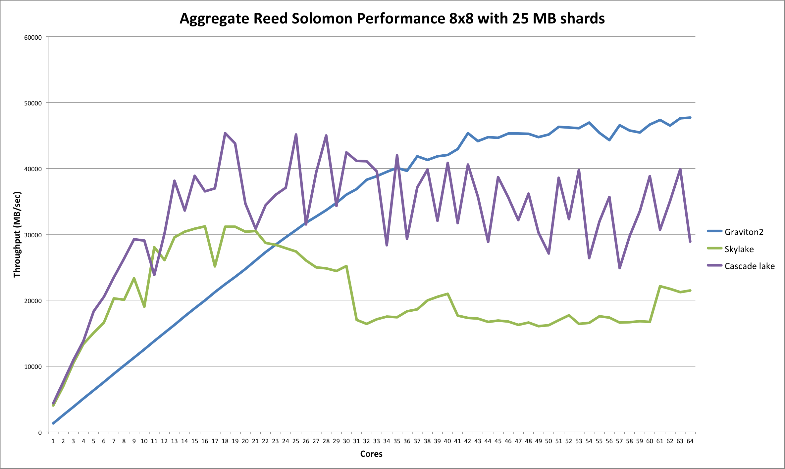

# Intel rules single-core performance but ARM dominates multi-core performance

The recent announcement from AWS about the general availability of their new ARM-powered Graviton2 servers caused us to take another look at the performance of these ARM servers. In this blog post we describe the results which you may find interesting.

## Introduction

Minio is an S3-compatible object storage server with a particular focus on high performance. It is capable of reading and writing 10s of GBs per second using ordinary harddisks as well as even 100s of GBs per second using 100 Gbit networking in combination with SSDs or NVME drives.

(TODO: add links to performance blog posts.)

In order to achieve these high performance results, minio takes advantage of the tightly integrated assembly language feature of Golang (minio's primary development language).

Two of Minio's core algorithms that are computationally demanding are erasure coding (for data durability) and hashing (for bit-rot detection). Both these algorithms are heavily optimized using SIMD (single instruction multiple data) instructions not just for the Intel platform (AVX2 and AVX512) but also for ARM (NEON) as well as PowerPC (VSX). 

A third key algorithm that minio relies on is encryption. Due to the fact that the Golang's standard library offers great support for various encryption using optimized code, minio relies on these implementations.

Because of its optimized nature of its core algorithms, minio is a great target to do comparative benchmarking between these different CPUs. But, in order to eliminate any system effects such as networking speeds and/or storage media throughputs, we chose to do a separate benchmarking test as described low.

## Benchmarking methodology

In order to compare how the Graviton2 CPUs stack up against Intel, we ran tests on two different types of EC2 instances, for Intel we used c5.18xlarge whereas for ARM/Graviton2 we used the m6g.16large. 

|          | Intel Skylake | ARM Graviton2  |
| Cores    |            72 |            64  |
| GHz      |               |                |
| L1 cache |               |                |
| L2 cache |               |                |
| L3 cache |               |                |

Since the Intel CPU has 8 more (hyperthreaded) cores as compared to the ARM cpu, we limited the maximum number of threads to 64 to create an equal battle field.

You can find the code in the [minio-benchmarking]() repository on github.

## Erasure coding 

The combined chart below shows on the left the single core performance of running an 8 data and 8 parity (reed solomon) erasure coding encoding step as a function of varying data shard sizes ranging from 1 MB to 25 MB. Intel Skylake here has a clear and large performance advantage over the ARM Graviton2 CPUs. It decrease somewhat as data shard sizes get larger whereas the ARM performance remains almost unchanged.

If we look at the graph on the right for the multi-core performance (all 64-cores are 100% busy doing erasure coding on both platforms), we essentially see an inverted picture. The aggregated ARM performance is remarkably flat and about 2x faster compared to Intel with the gap actually widening as the data shard sizes increase. 

## Highwayhash

Turning our attention to minio's hashing algorithm, we can see a comparable pattern.
For single core performance, Intel has the clear upper hand with lesser advantage as the block size gets larger.

Regarding multi-core performance, the tables have turned again with ARM outperforming Intel by over 2x pretty much for all different block sizes.

## Encryption

Lastly, for encryption the pattern is the same again. On single core Intel is clearly superior although the gap decreased as the block size goes up (and with ARM yet again being almost completely consistent in terms of its performance).

Then when it comes to multi-core performance, ARM again beats Intel by more than double. 

## Linear scalability?

Based on all the data that we gathered, we were able to produce another interesting chart. It shows the (aggregated) reed solomon erasure coding performance as a function of the number of cores. This clearly shows the point where the multi-core performance of the Graviton2 CPUs overtakes 

TODO: Make x-axis logarithmic 

## Conclusion 

TODO: Add conclusion

## Things to watch out for 

TODO:
- Ampere computing: Altra with PCI Gen 4 support
- Companies such as nuvia designing custom (ARM?) CPUs
